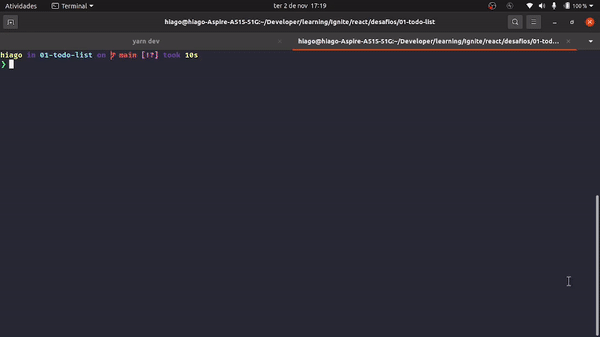

# Todo App - Desafio 01 - Trilha React

- Projeto desenvolvido durante o treinamento Ignite da Rocketseat



# Executar e Testar

- Requisito: NodeJs

```bash
# Depois de clonar o projeto, navegue até a pasta raiz dele instale as dependências com o comando...
yarn install
# ou
npm i

# Para executar o projeto rode o comando
yarn dev
# ou
npm run dev

# Para executar os testes...
yarn test
# ou
npm run test
```

## Link para o desafio

[Desafio 01 - Trilha React - Ignite](https://www.notion.so/Desafio-01-Conceitos-do-React-51e4099a6e2f4d4bae94f9fe75bb769d)
